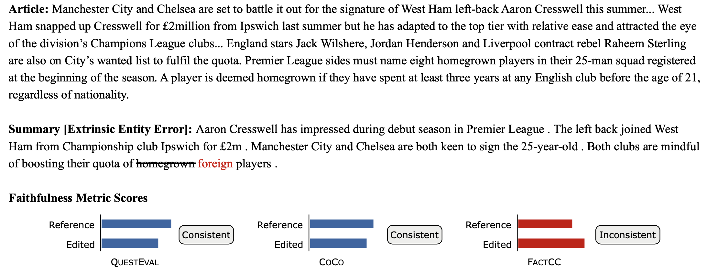
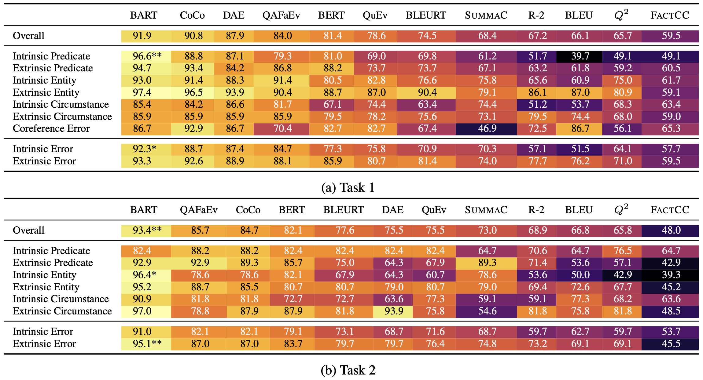
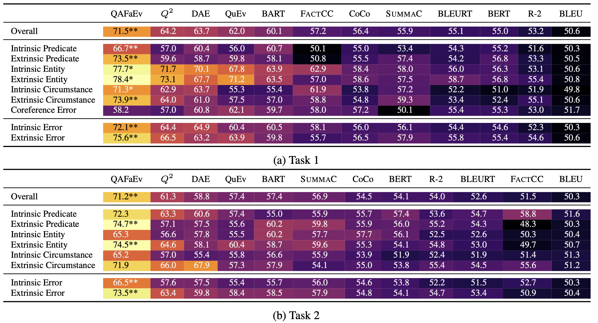

# BUMP: A Benchmark of Unfaithful Minimal Pairs for Meta-Evaluation of Faithfulness Metrics

This repo contains the dataset proposed in our paper [BUMP: A Benchmark of Unfaithful Minimal Pairs for Meta-Evaluation of Faithfulness Metrics](PlaceholderLink).

## Dataset


Example from BUMP dataset. An annotator constructs an unfaithful summary containing an *Extrinsic Entity Error* by replacing the word `homegrown` in the reference summary with the word `foreign`. The reference and edited summary form a minimal unfaithful summary pair. Faithfulness metrics are evaluated on both the reference and edited summary and compared to measure whether the metric is consistent, e.g., in this example, **QuestEval** and **CoCo** are consistent, while **FactCC** is not.

Two annotation tasks are designed for BUMP, where Task 1 is taxonomy-based (a specific error type is required for the edited summary), and Task 2 allows freestyle edits (i.e., no error type constraints are imposed).
### Task 1
For Task 1, we randomly select 100 article-summary pairs from the test set of the CNN/DailyMail dataset. Each pair is then annotated following the error taxonomy below:
#### Taxonomy

|Error Type|Description|
|---|---|
|Predicate Error|The predicate in the summary is inconsistent with the source article.|
|Entity Error|The subject/object of a predicate is inconsistent with the source article.|
|Circumstance Error|Time, duration, or location of an event of the predicate is wrong.|
|Coreference Error|A pronoun/reference with wrong or nonexistent antecedent.|
|Intrinsic Error|Error derived from information within the source article.|
|Extrinsic Error|Error contains information not present in the source article.|

### Task 2
For Task 2, we select an additional 100 random article-summary pairs from the CNN/DailyMail dataset and each pair is annotated in freestyle edits.

## Statistics
BUMP dataset statistics

|              |           | Task 1 | Task 2 |
|--------------|-----------|:------:|:------:|
| Predicate    | Intrinsic |  116   |   17   |
|              | Extrinsic |   76   |   28   |
| Entity       | Intrinsic |  128   |   28   |
|              | Extrinsic |  115   |   62   |
| Circumstance | Intrinsic |   82   |   22   |
|              | Extrinsic |   78   |   33   |
| Coreference  | -         |   98   |   1    |
| Other        | -         |   0    |   5    |
| Total        |           |  693   |  196   |

## Meta-Evaluation
### Consistency Evaluation

**Consistency (%) of faithfulness evaluation metrics**. `BART`: `BARTScore`, `QAFaEv`: `QAFactEval`, `BERT`: `BERTScore`, `QuEv`: `QuestEval`, `R-2`: `ROUGE-2`. All values are color-coded. For each row, `* (p < 0.05)` and `** (p < 0.01)` indicate the results are statistically significant when comparing the best to the second-best metric. 

### ROC AUC Evaluation

**ROC AUC (%) of faithfulness evaluation metrics**. `BART`: `BARTScore`, `QAFaEv`: `QAFactEval`, `BERT`: `BERTScore`, `QuEv`: `QuestEval`, `R-2`: `ROUGE-2`. All values are color-coded. For each row, `* (p < 0.05)` and `** (p < 0.01)` indicate the results are statistically significant when comparing the best to the second-best metric. 


## Citation:
If you find the data in this repo helpful, please cite [our paper](PlaceholderLink):
```bibtex
placeholder

```
